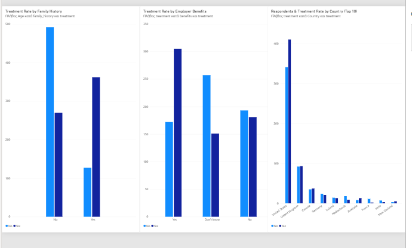

# Mental Health in Tech Survey — Data Cleaning, SQL Analysis & Dashboard
**Exploring mental health treatment-seeking behavior among tech workers**

---

## Overview

This project analyzes the [OSMI Mental Health in Tech Survey](https://www.kaggle.com/datasets/osmi/mental-health-in-tech-survey)
(2014), a 1,259-response survey on attitudes toward mental health and treatment-seeking
behavior in the tech industry. The workflow covers the full analyst pipeline: raw data
cleaning → SQL analysis → interactive dashboard.

- **Source:** OSMI (Open Sourcing Mental Illness), via Kaggle
- **Raw size:** 1,259 responses × 27 columns
- **Tools used:** Python (pandas, for cleaning), SQL (SQLite), Power BI

---

## Data Cleaning

The raw dataset had two major data-quality issues typical of open survey data:

**1. Invalid `Age` values.** The raw column contained impossible entries such as `-1726`,
`-29`, `5`, `329`, and `99999999999`. These were identified and set to null (8 values
affected), keeping the dataset's real age range intact (18–72).

**2. Unstandardized `Gender` free-text field.** Respondents typed their gender freely,
producing **49 distinct raw values** for what are effectively 3 categories — e.g.
`M`, `m`, `Male`, `male`, `Cis Male`, `Malr`, `Man`, `msle` all needed to map to
**Male**. These were consolidated into `Male`, `Female`, and `Other/Unspecified` using
a lookup-based normalization.

**3. Missing values.** `self_employed` (18 missing) was filled as `No` (the majority
class); `work_interfere` (264 missing) and `state` (515 missing, mostly non-US
respondents) were filled with explicit `Not applicable` / `Not specified` labels rather
than dropped, to preserve every respondent row for analysis. The free-text `comments`
column was dropped as out of scope for structured analysis.

**Result:** a clean, analysis-ready dataset (`survey_clean.csv`) with no silently
missing categorical data and a trustworthy numeric `Age` field.

---

## SQL Analysis

All queries are in [`analysis_queries(1).sql`](analysis_queries(1).sql), run against the
cleaned data loaded into SQLite. Key results:

**Overall:** 50.6% of respondents (637 of 1,259) have sought treatment for a mental
health condition.

| Question | Finding |
|---|---|
| Does family history matter? | **Yes — the strongest factor found.** 74.2% of respondents with a family history of mental illness sought treatment, vs. 35.5% without. |
| Do employer benefits matter? | Yes. 63.9% of respondents with employer-provided mental health benefits sought treatment, vs. 37.0% among those who didn't know if benefits existed — suggesting **awareness of benefits matters as much as the benefits themselves**. |
| Does company size matter? | Only slightly. Treatment rates ranged narrowly from 44–56% across company sizes, with no clear trend by size. |
| Does remote work matter? | Small effect: 52.7% (remote) vs. 49.7% (non-remote). |
| Does anonymity of mental health resources matter? | Yes. 60.8% of respondents who felt anonymity was protected sought treatment, vs. 45.3% of those unsure — again pointing to **awareness/clarity**, not just availability, as a driver. |

---

## Dashboard

An interactive Power BI dashboard was built on the cleaned dataset to make these
patterns explorable by company size, country, gender, and benefits status.

The dashboard includes three linked views: treatment rate by family history, treatment
rate by employer benefits, and respondent volume with treatment rate across the top 10
countries by response count.

---

## Skills Demonstrated

`Data Cleaning` `Data Validation` `SQL` `Aggregation & Grouping` `Power BI`
`Dashboard Design` `Exploratory Data Analysis` `Survey Data Analysis`

---

## Files

- `survey_clean.csv` — cleaned dataset used for SQL analysis and the dashboard
- `analysis_queries.sql` — all SQL queries used in this analysis
- `dashboard-overview.png` — Power BI dashboard screenshot

---

## Notes

Dataset released by OSMI under CC BY-SA 4.0. This project reframes a public dataset
around the applied analyst workflow — cleaning, querying, and visualizing — to
demonstrate SQL and BI tooling skills relevant to data analyst roles.
